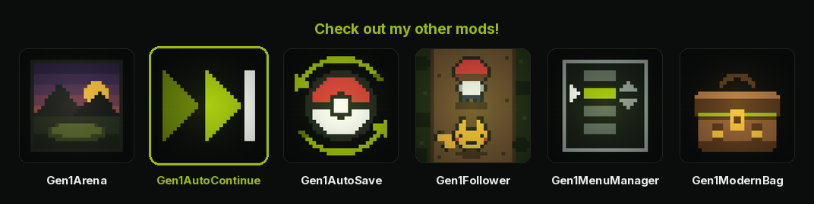

<p align="center">
  <a href="https://wild1walker.github.io/Gen1Wild/"></a>
</p>

<h1 align="center">Gen1AutoContinue</h1>

<p align="center">
  <a href="https://wild1walker.github.io/Gen1Wild/"></a>
</p>

<p align="center">
  <b>Boot to title, one press, playing</b>
</p>

Press START or A at the title screen and your save loads. No CONTINUE / NEW
GAME / OPTION menu, no PLAYER / BADGES / POKéDEX / TIME window — one press
instead of four.

Boot lands on the title. The copyright card and the attract movie are skipped
too, so the whole launch is: title, one press, playing.

The title itself keeps its logo drop, its cycling title mon, its exit cry and
its white-out — that part is the game announcing itself, and it costs nothing.
The menu you answer the same way every time is what goes.

## Installing

**From the launcher, by index.** In **MODS > FIND MODS**, add the index

```
wild1walker/Gen1AutoContinue
```

and the mod shows up as a card you can install and update in place.

**By hand.** **MODS > Import mod .zip**, using the archive from the
[latest release](../../releases/latest).

Then boot a save and press START.

## Building and testing it yourself

The suite is not standalone — it compiles against the engine's mod-SDK
harness. From a [gen1recomp](https://github.com/bryanthaboi/gen1recomp)
checkout with this repo's contents copied to `mods/gen1_auto_continue/`:

```sh
python3 tools/modkit.py lint mods/gen1_auto_continue
lua5.4 mods/gen1_auto_continue/tests/gen1_auto_continue_test.lua
```

`python3 tools/modkit.py validate gen1_auto_continue --base imported` checks it
against a booted loader as well, but that needs extracted ROM data in the
checkout and fails in `src/core/Data.lua` without it.

## The buttons

| Press | What happens |
|---|---|
| START / A | Loads your save |
| B | EXIT GAME |
| SELECT | The ordinary CONTINUE / NEW GAME / OPTION / EXIT menu |

Three buttons, no holds. B and SELECT are both dead inputs on the vanilla
title, so neither takes anything away.

B dispatches the engine's own EXIT GAME row rather than an imitation of it, so
whatever that row does on your build is what B does — on desktop it usually
restarts into the launcher rather than closing the process. There is no
confirmation, which is safe here for one reason: at the title no save is
loaded, so there is nothing to lose. Turn it off with `B EXITS GAME` if you
would still rather not have a quit one keypress from a resume.

SELECT is a press, not a hold. Rather than reproduce the cry and the white-out,
it hands the engine a START edge — the queued press lands on the next input
step, so the vanilla exit sequence plays in full and the menu arrives exactly
as it always did.

| Option | Default | What it does |
|---|---|---|
| `AUTO CONTINUE` | ON | Turn the skip off without uninstalling. |
| `B EXITS GAME` | ON | Off leaves B dead, as in vanilla. |
| `SKIP INTRO` | ON | Off plays the copyright card and attract movie in full. |

## The screens before the title

`Game:load` pushes exactly one screen ahead of the title, with the title as its
`onDone`: `IntroMovie` on Red/Blue (the copyright card, the GAME FREAK stars,
the Gengar/Nidorino fight) or `YellowIntro` for Yellow's eighteen-scene movie.
Both expose `finish()`, which pops and runs `onDone`.

The mod finishes it on the update *after* the push — and since the push happens
inside `Game:load`, that update is the first one of the session. Not one frame
of the intro is ever drawn: no flash of the copyright card, and no clipped note
of `Music_IntroBattle`, because the phase that starts it never runs.

This is not an invented shortcut. `IntroMovie` already finishes on its first
update when `field.intro.skip` is set — the mod takes the same path at runtime
so the option can be toggled without a data patch. If `finish()` somehow does
not take, the vanilla update is put back and the intro plays, because a boot
that hangs on a screen is worse than a boot that is four seconds long.

A total conversion that names its own boot screen in `field.boot.screens` is
honoured; an id the mod does not recognise is left alone.

## What happens when there is nothing to continue

The main menu appears, as it should. The mod does not probe for a save file —
it asks `onContinue` and reads the answer off the state stack. A successful
load runs `Game:restoreSave`, which empties the stack and pushes the overworld,
so if the title is still on top afterwards nothing loaded and the vanilla menu
is built instead. First boot, a deleted save and a save too damaged to recover
all take that same path.

## How it attaches

The title is a stack state (`src/ui/TitleState.lua`). Its route out of the
attract loop is:

```
update()    phase "loop", START/A pressed  ->  phase "exitCry"
update()    cry finished                   ->  toMenu()
toMenu()    whiteFlash, then               ->  menuOpen = true; openMenu()
openMenu()  builds CONTINUE / NEW GAME / OPTION / EXIT and pushes the Menu
```

The mod subscribes to `screen.pushed` and shadows two methods **on the
instance** — the engine class is never touched, so a second title (QUIT from
the START menu builds a fresh one) gets its own pair and uninstalling leaves
nothing behind.

- `update` reads B and SELECT, and arms the skip on the single frame the press
  registers.
- `openMenu` is where the skip happens, which puts it *after* the white-out.
  The frame the save lands on was going to be a blank one either way.

Intercepting at `openMenu` rather than `toMenu` is deliberate: `toMenu` owns
the whiteFlash, and re-creating that transition from a mod would mean
requiring `src.render.Transition` and declaring `engine_internals` for
something the engine already does correctly one call further down. This mod
requests **no permissions at all**.

The same reasoning drives how B quits. `EXIT GAME`'s action ends in
`love.event.quit()`, which the sandbox blocks (`BLOCKED_LOVE` in
`src/mods/Sandbox.lua`) — and rebuilding it would be guesswork anyway, since
`main.lua`'s `love.quit` handler decides whether that becomes a process exit or
a restart into the launcher. So B lets `openMenu` build the list once, takes the
menu straight back down within the same update (nothing is ever drawn), and runs
the real row. If no row can be identified it logs and does nothing, because a
dead button beats a menu you did not ask for.

## Compatibility

- **Link play** — `affects_link: false`. Nothing in a link fingerprint
  changes; this only moves a menu.
- **Other title-menu mods** — anything wrapping `ui.title_menu.items` still
  works. Its rows simply are not built when the skip fires, and SELECT gives
  you the fully modded menu. This mod wraps that hook too, at the front of the
  chain, but only reads the list on the way in — it never alters it.
- **Gen 2** — inert. Gold's title (`src/ui/gen2/TitleState.lua`) calls
  `onContinue` straight from `update` and has no `openMenu`, so it fails the
  shape check and is left alone rather than erroring.
- **Autosave mods** — no interaction. This mod reads the save path, never
  writes it.

## Tests

`tests/gen1_auto_continue_test.lua` drives a stand-in `TitleState` with the
same shape and call order as the real one, through the real runtime bus:
37 checks covering the skip, B, SELECT, all three toggles, first boot, a load
that throws, a second title instance, idempotent re-attach, both intros, an
intro whose `finish()` will not take, an unrecognised screen id, and the
payloads that should be ignored. The stand-in input models `Input:step`'s queued edge, so the
one-frame delay the SELECT path relies on is actually exercised. It is `export-ignore`d in
`.gitattributes` — and listed in `.modkitignore` for anyone packing with
modkit instead — so the engine requires it needs do not ship in the packaged
archive.

---

## Credits

By **Wild**.

Built on the boot and menu seams of [Pokemon Gen1Recomp](https://github.com/bryanthaboi/gen1recomp), and on the [pret](https://github.com/pret) disassembly of
Pokemon Red, Blue and Yellow: `engine/movie/title.asm` and
`engine/menus/main_menu.asm` are the flow this mod shortens, and reading them is
how it knows which steps are safe to skip.
